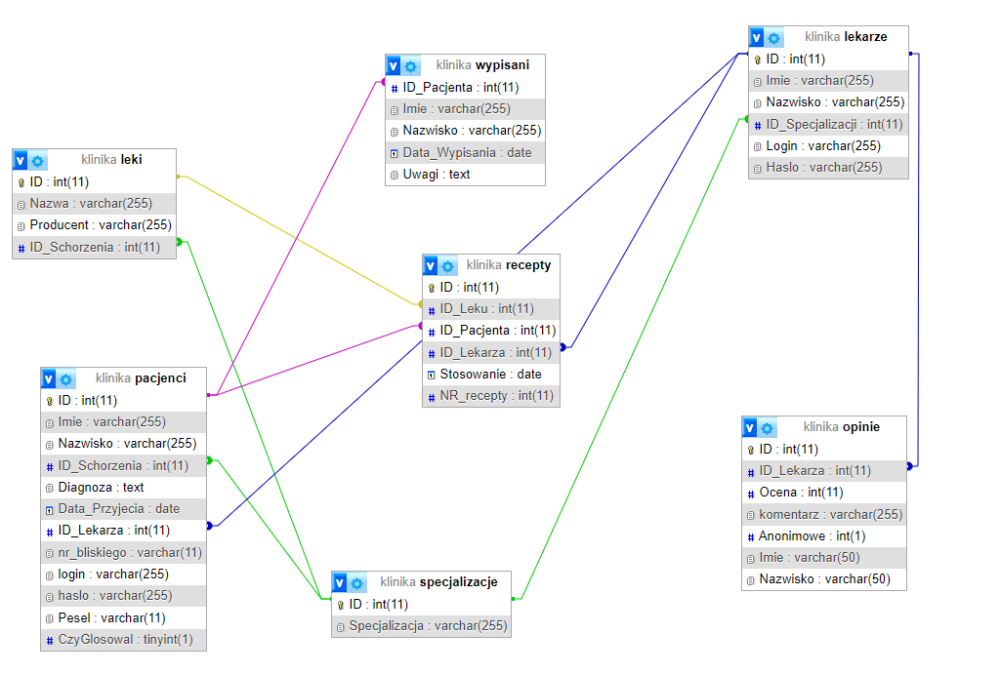

# Central Hospital system
## Final project for database course
## Disclaimer: app works with local MySQL database, hosted locally.
### Database structure:
| Table name| Description |
|----------|----------|
| Doctors (lekarze)    | Contains personal and login details of every doctor      |
| Patients (pacjenci)    | Same as *doctors*, patient is assigned to the doctor based on patient's disease |
| Specializations (specjalizacje)    | Contains list of fields that doctors can specialize in|
| Medicaments (leki)    | List of miscellaneous medicaments with their producers      |
| Prescriptions (recepty)    | Every doctor can prescribe some medicament to their patients      |
| Opinions (opinie)    | Every patient can grade their doctor **ONCE**, anonymously or not      |
| Discharged (wypisani)    | Once you get on this hospital's database you always stay there |

### Functionalities
* 
Log in form - possible to log in as a doctor, patient, or administrator

<table>
<tr>
    <td align="center">Doctor UI</td>
    <td align="center">Patient UI</td>
    <td align="center">Admin UI</td>
    
  </tr>
  <tr>
    <td></td>
    <td></td>
    <td></td>
  </tr>
</table>  

* adding new **doctor** or **patient** to the system as admin user  
 -add gif here-
 
