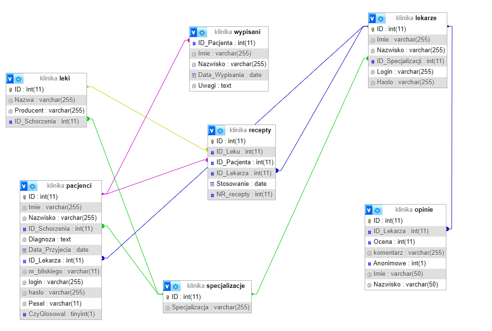

# Central Hospital system
## Final project for database course

## Prerequisites
- Docker and Docker Compose
- .NET 6 SDK (for running the application)
- Windows PowerShell or Command Prompt

## Configuration

- Copy `.env.example` to `.env`
- Fill in local values in `.env`
- Do not commit `.env` to GitHub; only `.env.example` should be versioned

## Database Setup (Dockerized MySQL)

The application uses a containerized MySQL 8.0 database managed by Docker Compose.

### Starting the database

1. Navigate to the project root directory
2. Make sure `.env` exists and contains local values
3. Start the MySQL container:

```bash
docker-compose up -d
```

The database will automatically initialize with the schema and seed data from `database/init.sql`.

**Connection details:**
- Host: `127.0.0.1` for the WinForms app
- Host inside Docker network: `mysql`
- Port: `3306`
- Database, user and password are loaded from `.env`

### Stopping the database

```bash
docker-compose down
```

To also remove persisted data:
```bash
docker-compose down -v
```

### Database structure:
| Table name| Description |
|----------|----------|
| Doctors (lekarze)    | Contains personal and login details of every doctor      |
| Patients (pacjenci)    | Same as *doctors*, patient is assigned to the doctor based on patient's disease |
| Specializations (specjalizacje)    | Contains list of fields that doctors can specialize in|
| Medicaments (leki)    | List of miscellaneous medicaments with their producers      |
| Prescriptions (recepty)    | Every doctor can prescribe some medicament to their patients      |
| Opinions (opinie)    | Every patient can grade their doctor **ONCE**, anonymously or not      |
| Discharged (wypisani)    | Once you get on this hospital's database you always stay there |



### Functionalities
* <p>Log in form - possible to log in as a doctor, patient, or administrator</p>

<table>
<tr>
    <td align="center">Doctor UI</td>
    <td align="center">Patient UI</td>
    <td align="center">Admin UI</td>
    
  </tr>
  <tr>
    <td></td>
    <td></td>
    <td></td>
  </tr>
</table>  

* adding new **doctor** or **patient** to the system as admin user  
 -add gif here-

## Running the Application

1. **Start the MySQL database:**
   ```bash
   docker-compose up -d
   ```
   Wait a few seconds for the container to be ready (check health status with `docker ps`)

2. **Build and run the application:**
   ```bash
   dotnet build
   dotnet run
   ```

The application reads database settings from `.env` at startup, so the code does not contain hardcoded credentials.

## Test Credentials

The database is seeded with test data:

### Doctor Login
- **Username:** `doktor1`
- **Password:** `haslo123`
- **Specialization:** Kardiologia (Cardiology)

### Patient Login
- **Username:** `pazjent1`
- **Password:** `haslo123`
- **Assigned Doctor:** Jan Kowalski

### Admin Login
- **Username:** `admin`
- **Password:** `admin`

## Important Notes

- All database queries are written with **raw SQL** (no ORM used)
- Database credentials are stored in `.env` file (add to `.gitignore` for security)
- `.env.example` is provided as a safe template for GitHub
- MySQL data persists in Docker named volume `mysql_data`

 
